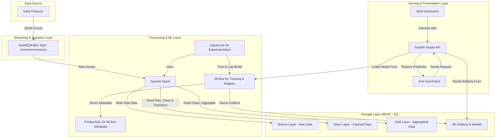

# Big Data Lakehouse Project - README

This document provides a comprehensive guide to setting up, running, and using this end-to-end Big Data Lakehouse project.

## 1. Overview

This project implements a scalable, containerized Big Data Lakehouse architecture designed for real-time data streaming, ETL (Extract, Transform, Load), machine learning model training, and API-based model serving.

The core technologies used include:

- **Containerization:** Docker & Docker Compose
- **Object Storage:** MinIO (S3-compatible)
- **Streaming Ingestion:** AutoMQ (Kafka-compatible)
- **Data Processing & ETL:** Apache Spark
- **ML Experimentation & Registry:** MLflow with a PostgreSQL backend
- **Interactive Development:** JupyterLab (with PySpark)
- **Model Serving:** FastAPI
- **Data Simulation:** A custom Python producer script

## 2. Architecture

The architecture is designed to handle data flow from ingestion to prediction, following the medallion architecture (Bronze, Silver, Gold layers) for data refinement.



## 3. Prerequisites

Before you begin, ensure you have the following installed on your local machine:

- **Docker:** [Installation Guide](https://docs.docker.com/get-docker/)
- **Docker Compose:** [Installation Guide](https://docs.docker.com/compose/install/)
- **Git:** For cloning the repository.

It is recommended to allocate at least 8GB of RAM to Docker to run all services smoothly.

## 4. Setup & Configuration

1.  **Clone the Repository**

    ```sh
    git clone https://github.com/Trenttzzz/fp-bigdata-01
    cd fp-bigdata-01
    ```

2.  **Environment Variables**
    The project uses a `.env` file in the root directory to manage credentials and configuration. Ensure your `.env` file exists and contains the necessary variables.

    **_File: `.env`_**

    ```env
    # MinIO Configuration
    MINIO_ROOT_USER=admin
    MINIO_ROOT_PASSWORD=password123

    # AutoMQ Configuration
    AUTOMQ_BOOTSTRAP_SERVERS=automq:9092

    # Database Configuration
    POSTGRES_DB=mlflow
    POSTGRES_USER=mlflow
    POSTGRES_PASSWORD=mlflow
    ```

## 5. Running the Application

1.  **Build and Start All Services**
    From the root directory of the project, run the following command. This will build the custom Docker images and start all services in detached mode.

    ```sh
    docker-compose up --build -d
    ```

2.  **Check Service Status**
    To verify that all containers are running, use:

    ```sh
    docker-compose ps
    ```

    You should see all services listed with a `running` or `healthy` state. It may take a few minutes for all services to become healthy, especially `spark-master` and `jupyter`.

3.  **Stop the Application**
    To stop all services and remove the containers, run:
    ```sh
    docker-compose down
    ```
    To stop the services and also remove the data volumes (for a completely clean restart), use:
    ```sh
    docker-compose down -v
    ```

## 6. Accessing Services

Once the application is running, you can access the various UIs and endpoints through your browser:

| Service              | URL                          | Credentials / Notes                                           |
| -------------------- | ---------------------------- | ------------------------------------------------------------- |
| **Dashboard**        | `http://localhost:3000`      | Main entry point for visualization.                           |
| **Model API (Docs)** | `http://localhost:8000/docs` | Interactive FastAPI documentation.                            |
| **JupyterLab**       | `http://localhost:8888`      | Token may be printed in logs (`docker-compose logs jupyter`). |
| **MLflow UI**        | `http://localhost:5000`      | Track experiments and manage model lifecycle.                 |
| **Spark Master UI**  | `http://localhost:8081`      | Monitor Spark jobs and workers.                               |
| **MinIO Console**    | `http://localhost:9001`      | User: `admin`, Pass: `password123`                            |
| **AutoMQ Console**   | `http://localhost:8080`      | Monitor AutoMQ topics and streams.                            |
| **PostgreSQL Port**  | `localhost:5432`             | For direct DB inspection if needed.                           |

## 7. Project Usage & Workflow

Here is a typical workflow for using the platform:

1.  **Verify Data Production**
    The `data-producer` service starts generating mock e-commerce events immediately. You can view the stream of events by checking its logs:

    ```sh
    docker-compose logs -f data-producer
    ```

    You should see log messages like `Sent to AutoMQ: purchase - ...`.

2.  **Process Data with Spark in JupyterLab**

    - Navigate to JupyterLab at `http://localhost:8888`.
    - Open the `notebooks` directory. Here you would typically find notebooks for:
      - **Streaming ETL:** Reading from the `ecommerce-events` AutoMQ topic, processing the data, and writing it to MinIO as Delta tables (Bronze -> Silver -> Gold).
      - **Model Training:** Reading from the refined Gold tables, training an ML model (e.g., for churn prediction or sales forecasting), and logging the experiment to MLflow.

3.  **Manage Models in MLflow**

    - Navigate to the MLflow UI at `http://localhost:5000`.
    - Find your trained model under "Experiments" and register it.
    - Go to the "Models" tab, find your registered model, and transition its version to the **Staging** or **Production** stage. **This is a required step for the API to find the model.**

4.  **Get Predictions from the Model API**
    Once a model is in the "Staging" or "Production" stage, you can send requests to the prediction endpoint. Use a tool like `curl` or the interactive docs at `http://localhost:8000/docs`.

    **_Example `curl` Request:_**

    ```sh
    curl -X POST "http://localhost:8000/predict/your-model-name" \
    -H "Content-Type: application/json" \
    -d '{
      "features": {
        "feature1": 10.5,
        "feature2": "value_a",
        "feature3": 0.98
      }
    }'
    ```

    Replace `your-model-name` with the name you used in MLflow and update the `features` object to match your model's expected input.

## 8. Project Structure

```
fp-big-data/
├── api/                  # FastAPI code for the Model Serving API
├── automq-logs/          # Logs for the AutoMQ service
├── config/               # Configuration files (e.g., spark-defaults.conf)
├── dashboard/            # Frontend code for the web dashboard
├── datasets/             # Sample datasets used by producer/notebooks
├── models/               # Directory for storing local model files (if any)
├── notebooks/            # Jupyter notebooks for ETL and ML
├── producer-scripts/     # Python script for the data producer
├── spark-apps/           # Spark applications to be submitted
├── .env                  # Environment variables for Docker Compose
├── docker-compose.yml    # Main Docker Compose file to orchestrate services
└── Dockerfile.*          # Dockerfiles for building custom service images
```

## 9. Troubleshooting

- **Service not starting:** Check the logs for a specific service using `docker-compose logs <service_name>`. For example, `docker-compose logs jupyter`.
- **Permission errors on mounted volumes:** Ensure Docker has the correct permissions to read/write to the directories mounted in `docker-compose.yml`.
- **High resource usage:** This project runs many services and can be resource-intensive. Use `docker stats` to monitor CPU and memory usage of the containers. If necessary, shut down unused services.
- **`404 Not Found` from Model API:** Ensure the model name in your request is correct and that a version of that model has been promoted to the "Production" or "Staging" stage in the MLflow UI.

```

```

```

```
