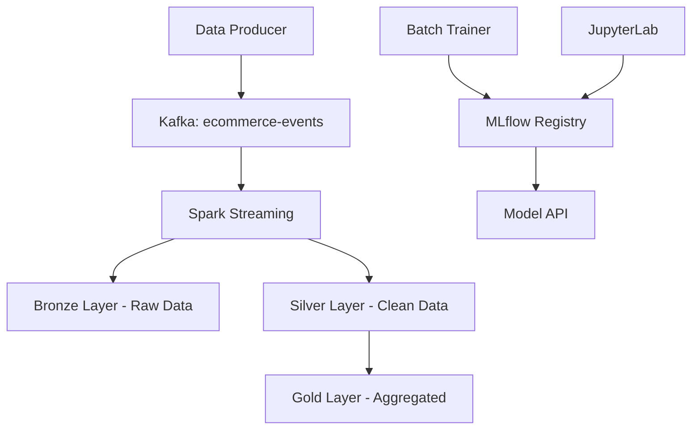

# Big Data Lakehouse Project - README

This document provides a comprehensive guide to setting up, running, and using this end-to-end Big Data Lakehouse project.

## 1. Overview

This project implements a scalable, containerized Big Data Lakehouse architecture designed for real-time data streaming, ETL (Extract, Transform, Load), machine learning model training, and API-based model serving.

The core technologies used include:

- **Containerization:** Docker & Docker Compose
- **Object Storage:** MinIO (S3-compatible)
- **Streaming Ingestion:** Apache Kafka (with Zookeeper)
- **Data Processing & ETL:** Apache Spark
- **ML Experimentation & Registry:** MLflow with a PostgreSQL backend
- **Interactive Development:** JupyterLab (with PySpark)
- **Model Serving:** FastAPI
- **Batch ML Training:** Automated training service

## 2. Quick Start Guide

### Step 1: Prerequisites

Ensure you have installed:

- **Docker Desktop:** [Download here](https://docs.docker.com/get-docker/)
- **Git:** For cloning the repository
- **At least 8GB RAM** allocated to Docker

### Step 2: Clone and Setup

```bash
# Clone the repository
git clone https://github.com/Trenttzzz/fp-bigdata-01
cd fp-bigdata-01

# Make scripts executable (Linux/Mac)
chmod +x scripts/check-status.sh
```

### Step 3: Start the Lakehouse

```bash
# Start all services
docker-compose up --build -d

# Check status
docker-compose ps

# Monitor startup (optional)
docker-compose logs -f
```

### Step 4: Verify Services

Run the status check script:

```bash
# Check all services
./scripts/check-status.sh

# Or manually check
docker-compose ps
```

### Step 5: Access the Platform

Once all services are running:

| Service           | URL                        | Purpose                                |
| ----------------- | -------------------------- | -------------------------------------- |
| **JupyterLab**    | http://localhost:8888      | Data exploration & ML experiments      |
| **MLflow UI**     | http://localhost:5000      | ML model tracking & registry           |
| **Model API**     | http://localhost:8000/docs | API for model predictions              |
| **Spark UI**      | http://localhost:8081      | Monitor data processing jobs           |
| **MinIO Console** | http://localhost:9001      | Storage management (admin/password123) |

## 3. Architecture

The architecture follows the medallion architecture (Bronze, Silver, Gold layers) with automated batch training:



## 4. Using the Platform

### Data Flow Monitoring

```bash
# Monitor data production
docker-compose logs -f data-producer

# Monitor batch training
docker-compose logs -f batch-trainer

# Monitor Spark processing
docker-compose logs -f jupyter
```

### Working with Notebooks

1. Access JupyterLab at http://localhost:8888
2. Navigate to `notebooks/` directory
3. Start with:
   - `01_data_ingestion_tutorial.ipynb` - Learn data ingestion
   - `02_data_transformation_tutorial.ipynb` - Data transformation
   - `03_ml_training_tutorial.ipynb` - Manual ML training

### Model Predictions

Once models are trained (automatic via batch-trainer):

```bash
# Test purchase prediction
curl -X POST "http://localhost:8000/predict/purchase_prediction" \
-H "Content-Type: application/json" \
-d '{
  "features": {
    "category_encoded": 1,
    "device_encoded": 0,
    "price": 150.0,
    "quantity": 2,
    "event_hour": 14,
    "is_peak_hour": true,
    "user_avg_spent": 75.0,
    "user_purchase_rate": 0.3
  }
}'
```

## 5. Project Structure

```
fp-bigdata-01/
├── api/                     # FastAPI model serving
├── batch-trainer/           # Automated ML training
├── config/                  # Spark configuration
├── notebooks/               # Jupyter tutorials
├── scripts/                 # Utility scripts
├── docker-compose.yml       # Service orchestration
├── Dockerfile.*            # Container definitions
├── .env                    # Environment variables
└── README.md               # This file
```

## 6. Troubleshooting

### Common Issues

#### Services Won't Start

```bash
# Check Docker resources
docker stats

# Restart specific service
docker-compose restart <service-name>

# View logs
docker-compose logs <service-name>
```

#### Kafka Issues

```bash
# Check Kafka and Zookeeper
docker-compose logs kafka
docker-compose logs zookeeper

# Restart Kafka stack
docker-compose restart zookeeper kafka
```

#### No Models Available

The batch trainer automatically trains models. If models aren't available:

```bash
# Check batch trainer logs
docker-compose logs batch-trainer

# Verify MLflow is accessible
curl http://localhost:5000

# Check data production
docker-compose logs data-producer
```

### Debug Commands

```bash
# Status overview
./scripts/check-status.sh

# All service logs
docker-compose logs

# Follow specific service
docker-compose logs -f <service-name>

# Container shell access
docker-compose exec <service-name> /bin/bash

# Restart everything
docker-compose down && docker-compose up -d
```

### Reset Everything

```bash
# Stop and remove all data
docker-compose down -v

# Clean Docker system
docker system prune -a

# Start fresh
docker-compose up --build -d
```

## 7. Development Workflow

### For Data Scientists

1. Use **JupyterLab** for exploration and experimentation
2. Monitor data in **MinIO Console**
3. Track experiments in **MLflow UI**
4. Test models via **Model API**

### For Data Engineers

1. Monitor **Spark UI** for job performance
2. Check data flow via service logs
3. Modify configurations in `config/` directory
4. Scale workers by modifying `docker-compose.yml`

### For ML Engineers

1. Use **batch-trainer** for automated model updates
2. Register models in **MLflow Registry**
3. Deploy via **Model API**
4. Monitor predictions and performance

## 8. Next Steps

After getting the system running:

1. **Explore the notebooks** to understand the data pipeline
2. **Monitor the batch trainer** to see automated ML in action
3. **Try the Model API** to see real-time predictions
4. **Experiment with your own data** by modifying the producer
5. **Scale the system** by adding more Spark workers

## Need Help?

- Check service logs: `docker-compose logs <service-name>`
- Run status check: `./scripts/check-status.sh`
- Ensure Docker has enough memory (8GB recommended)
- Try restarting problematic services: `docker-compose restart <service-name>`

**Happy Data Engineering! 🚀**

```sh
docker-compose restart kafka
```

#### 9.2 Service Dependency Issues

Services have startup dependencies. If services fail with "dependency failed":

1. **Check the dependency chain:**

   ```sh
   docker-compose ps
   ```

2. **Restart in dependency order:**
   ```sh
   docker-compose up -d minio
   docker-compose up -d postgres
   docker-compose up -d automq
   docker-compose up -d spark-master
   # Then other services
   ```

#### 9.3 JupyterLab Access Issues

If JupyterLab is not accessible:

1. **Get the access token:**

   ```sh
   docker-compose logs jupyter | grep token
   ```

2. **Use the full URL with token:**
   ```
   http://localhost:8888/lab?token=<your-token>
   ```

#### 9.4 MLflow Model API Issues

If the Model API returns 404 for model predictions:

1. **Verify model registration in MLflow UI** at `http://localhost:5000`
2. **Ensure model stage is set to "Production" or "Staging"**
3. **Check model name matches the API endpoint**
4. **Verify MLflow connectivity:**
   ```sh
   docker-compose logs model-api
   ```

#### 9.5 Memory and Performance Issues

If services are slow or failing due to resource constraints:

1. **Monitor resource usage:**

   ```sh
   docker stats
   ```

2. **Increase Docker memory allocation** (Docker Desktop → Settings → Resources)

3. **Reduce service count for testing:**
   Comment out non-essential services in docker-compose.yml

4. **Clean up Docker resources:**
   ```sh
   docker system prune -a
   ```

#### 9.6 Network Connectivity Issues

If services cannot communicate:

1. **Check network status:**

   ```sh
   docker network ls
   docker network inspect fp-bigdata-01_lakehouse
   ```

2. **Restart the entire stack:**
   ```sh
   docker-compose down
   docker-compose up -d
   ```

#### 9.7 Data Volume Issues

If data is not persisting or volumes have permission issues:

1. **Check volume status:**

   ```sh
   docker volume ls
   docker volume inspect fp-bigdata-01_minio_data
   ```

2. **Reset all data (USE WITH CAUTION):**
   ```sh
   docker-compose down -v
   docker-compose up -d
   ```

### Debug Commands

- **View all service logs:** `docker-compose logs`
- **View specific service logs:** `docker-compose logs <service-name>`
- **Follow logs in real-time:** `docker-compose logs -f <service-name>`
- **Check service health:** `docker-compose ps`
- **Restart specific service:** `docker-compose restart <service-name>`
- **Access service shell:** `docker-compose exec <service-name> /bin/bash`

### Getting Help

If you encounter issues not covered here:

1. Check the logs for specific error messages
2. Verify all prerequisites are met
3. Ensure Docker has sufficient resources allocated
4. Try restarting the problematic service
5. Consider running a subset of services for testing

For persistent issues, please check the project repository for known issues and solutions.
